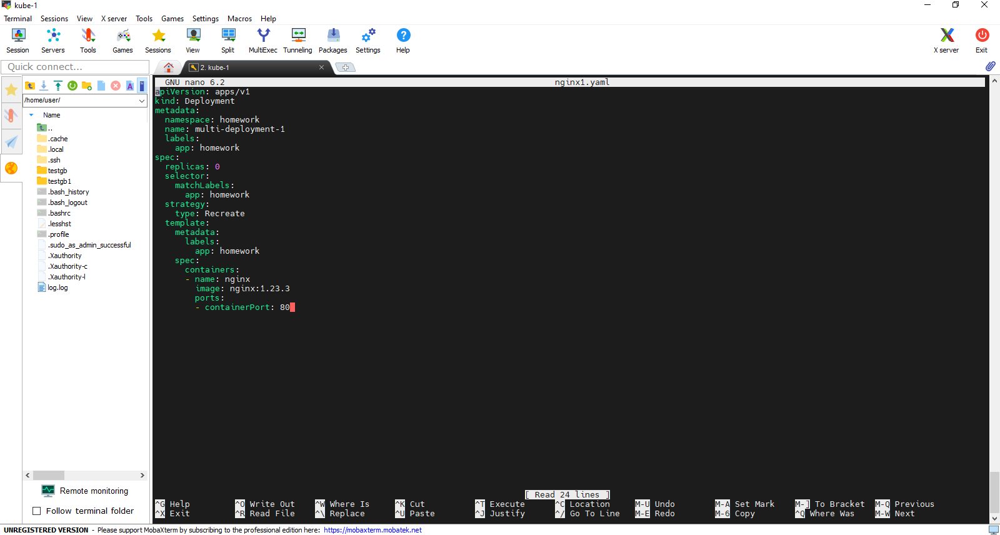
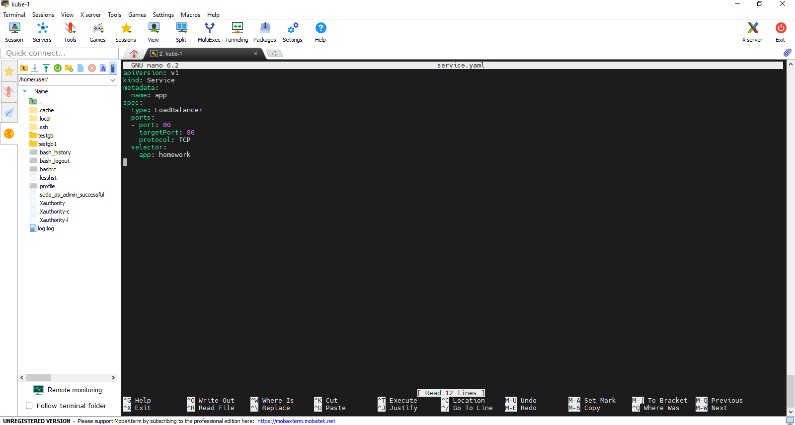
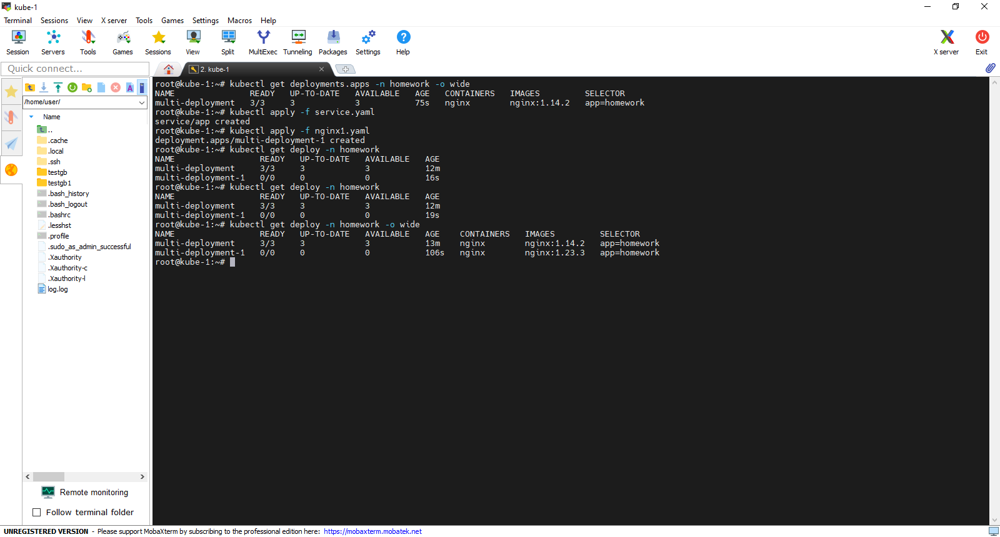
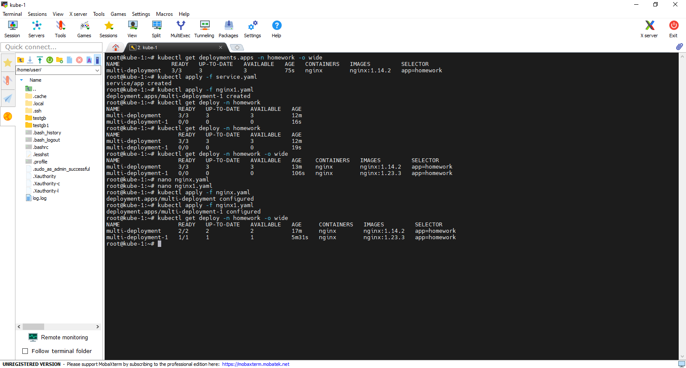
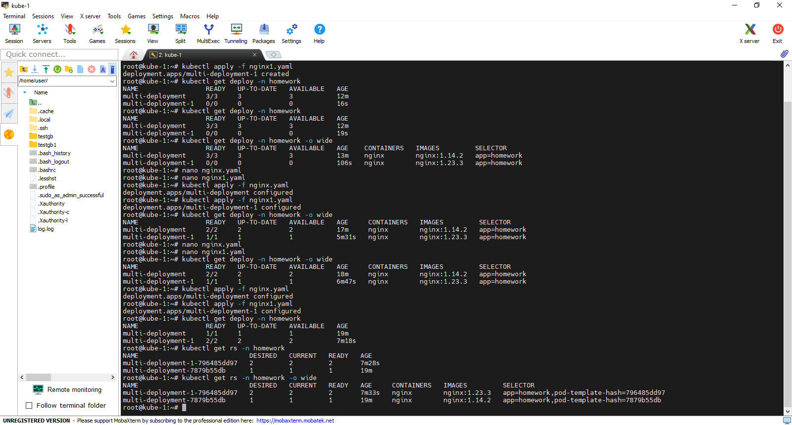
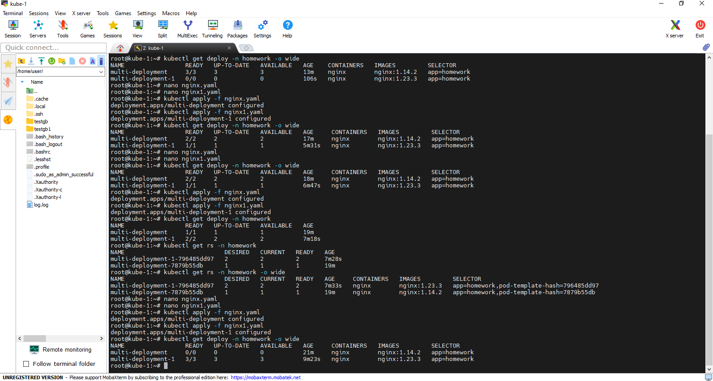

## Обновление с помощью Canary Deployment.
- необходимо создать два конфигурационных файла.
1) nginx.yaml 

в конфигурации файла видим, что у нас будет создано 3 реплики, версия nginx 1.14.2. Имя deployment будет multi-delpoyment/
2) nginx1.yaml

Во втором конфигурационном файле мы видим, что будет создано 0 реплик, так же версия nginx будет 1.23.3. Имя deployment будет multi-deployment-1.
- так же необходимо настроить балансировщик

3) Приступим к обновлению, впервую очередь необходимо запустить основной deploy, выполнив команду **kubectl apply -f nginx.yaml**.
Проверить, что все запустилось можем командой **kubectl get deployments.apps -n homework -o wide**

После запустим балансировщик коммандой **kubectl apply -f service.yaml.**
4) Следующим шагом запустим новый deploy c новой версие nginx, командой **kubectl apply -f nginx1.yaml**
Проверяем командой **kubectl get deploy -n homework -o wide** 

Видим что у нас два Deploy, первый с 3 репликами и версией nginx 1.14.2, второй с 0 репликами и версией nginx 1.23.3.
5) Далее нам необходимо менять количество реплик в наших кофигурационных файлах, в 1-ом в меньшую сторону, во 2-м в большую и до тех пор пока мы полность не перейдем на новую версию nginx.

